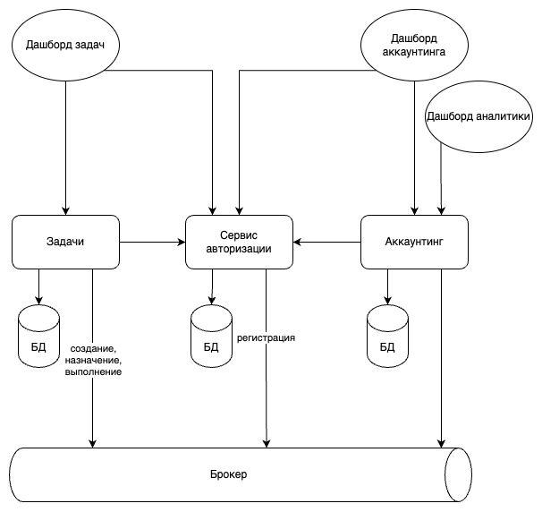

### Сервисы
#### Сервис авторизации
Менеджмент учетных записей попугов, аутентификация, авторизация.
#### Задачи
Создание, назначение и выполнение задач.
#### Аккаутнинг
Ведение костов задач, учет назначения и исполнения на лицевых счета, выплаты, аудит лицевых счетов.

### UI
#### Дашборд задач
Доступ рядовым, менеджерам и администраторам.
Менеджерам и администраторам кнопка распределения задач, рядовым список задач, кнопка исполнения.
#### Дашборд аккаунтинга
Доступ рядовым, бухгалтерам и администраторам.
Бухгалтерам и администраторам общая статистика, рядовым список событий своего лицевого счета.
#### Дашборд аналитики
Доступ только админам.
Сумма заработанного, сколько попугов ушло в минус, самая дорогая задача.

### События
#### Регистрация попуга
Продюсер: сервис авторизации.
Консюмеры: задачи для возможности назначения, аккаунтинг для создания ЛС.
#### Создание задачи
Продюсер: задачи.
Консюмеры: аккаунтинг для назначения костов.
#### Назначение задачи, исполнение задачи
Продюсер: задачи.
Консюмеры: аккаунтинг для учета на ЛС.

### Возможные дополнения/развитие
#### Сервис интеграции с почтой
Чтобы изолировать логику отправки оповещений, будет слушать событие выплаты и отправлять оповещение на почту.
#### BFF для UI
Чтобы хранить сразу модельку в том виде, в котором она нужна для представления/поиска на UI. Но в требованиях вроде нету, посчитал излишним.
