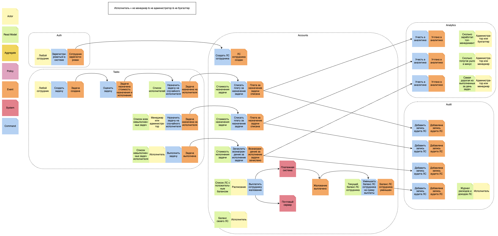
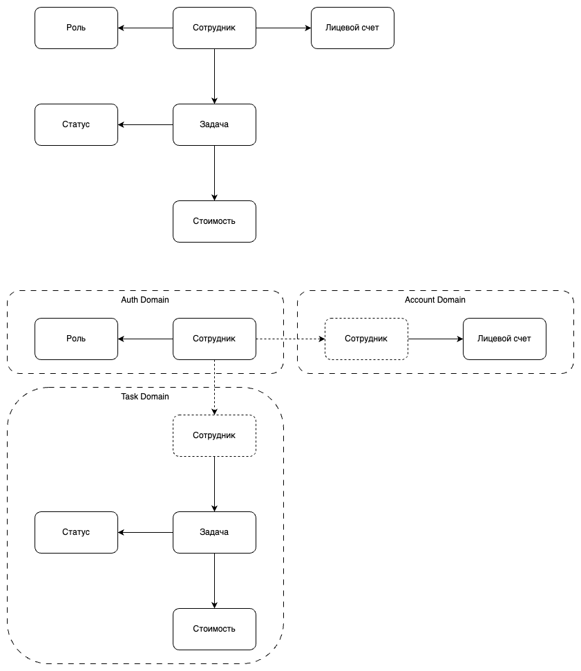
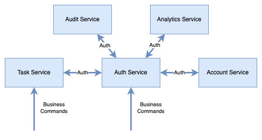
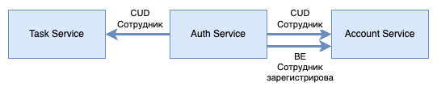
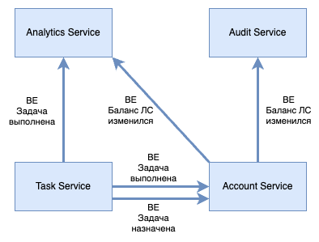

# Event Storming

# Домены
* Авторизация
* Задачи
* Лицевые счета

# Коммуникации
## Синхронные:
* Бизнес-команды для сервиса авторизации
* Бизнес-команды для сервиса задач
* Сам процесс авторизации

## Асинхронные
* CUD-события для Сотрудников
  * В составе данных нужна роль
* Бизнес-событие регистрации Сотрудника

* Бизнес-событие назначения Задачи
* Бизнес-событие выполнения Задачи
* Бизнес-событие изменения баланса

