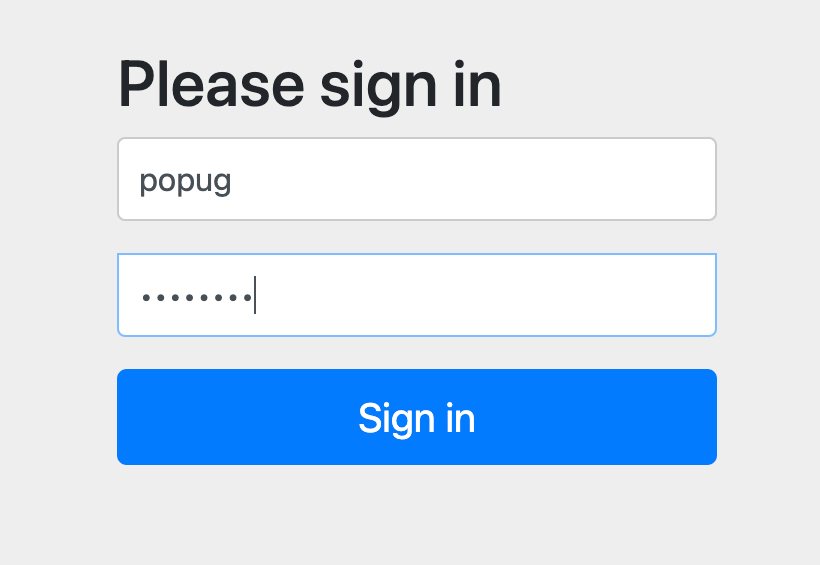
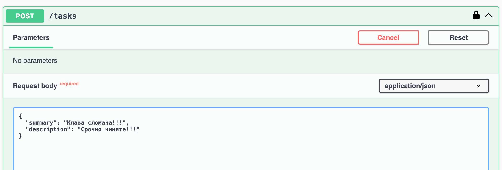

### Регистрация нового попуга
#### Админ авторизуется на сервере авторизации (SSO)

#### Регистрирует пользака (да-да, прямо с паролем)

#### Отправляются cud и business эвенты для нового пользователя

### Добавление задачи на доску
#### Новый попуг уже может залогиниться

#### И посмотреть кто он :)

#### А потом добавить задачу на доску

#### Отправляются cud и business эвенты для новой задачи

### Назначение задач
#### Но тут злобный админ жмет казино-кнопку (переназначение всех задач)

#### Незаконченные задачи переназначаются и отправляется куча эвентов о назначении задачи

#### А новый попуг вдруг обнаруживает что на него уже назначили задачу

#### И деньги ведь забрать должны

### Исполнение задач
#### Ну ладно, придется исполнять

#### Отправляются эвенты что задача исполнена

#### А где деньги за то что попуг поработал?

