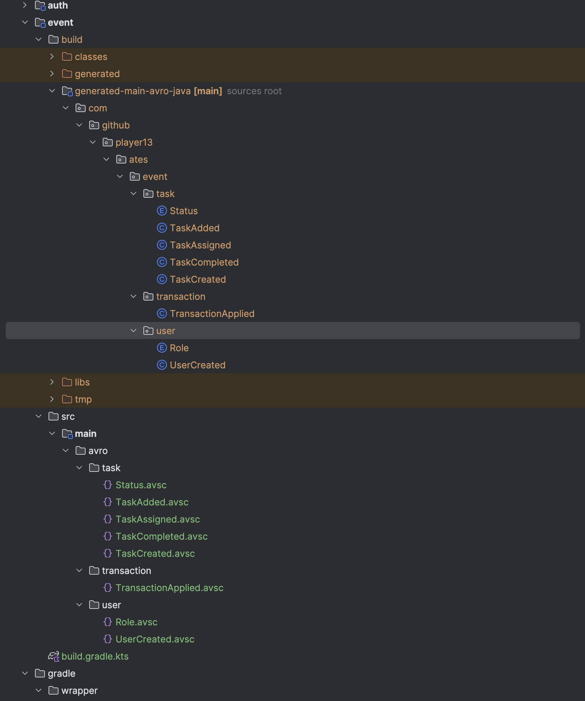
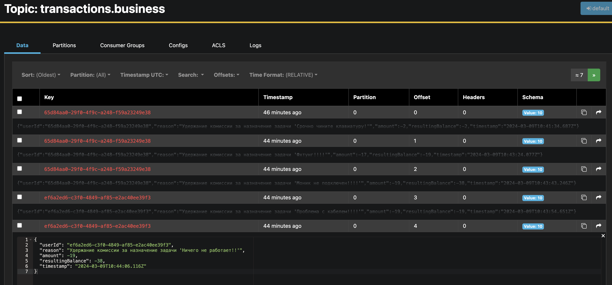
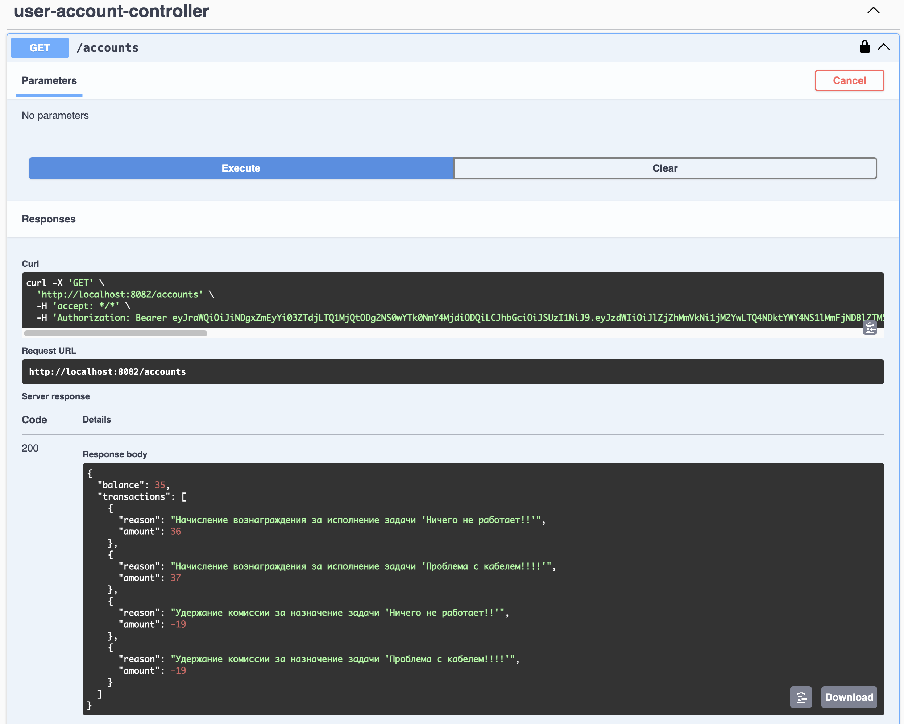
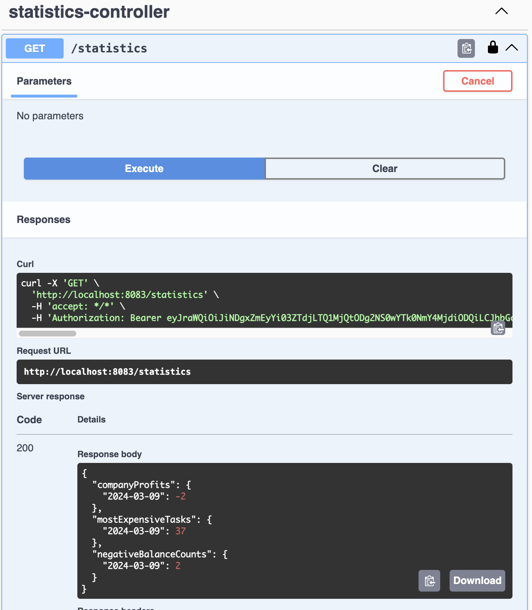
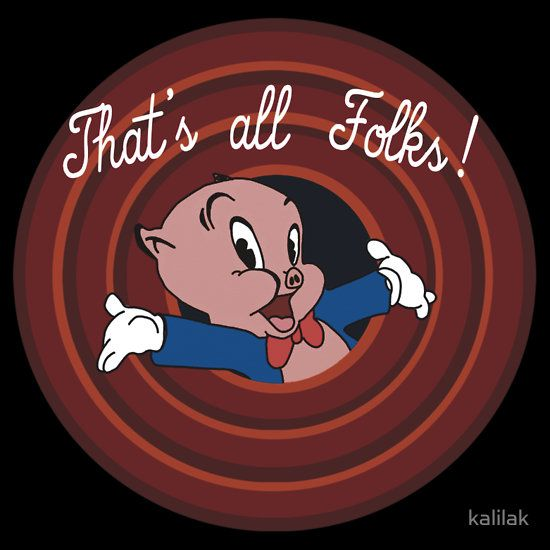

### Сериализация
#### Формат сериализации
Выбран формат AVRO, т.к. данные можно представить как в чиловекочитаемом виде (json), так и нет (binary).
Так же доступны инструменты для генерации java-классов.
#### Schema registry
Выбрана схема реджистри от конфлюента, т.к. есть нативная интеграция с кафкой и поддержка формата AVRO.
https://docs.confluent.io/platform/current/schema-registry/index.html
#### Генерация кода и загрузка схем
Выполнена в модуле event с помощью соответствующих gradle-плагинов.
Генерация запускается при сборке модуля, остальные модули подключают готовые java-классы.
Так же после запуска docker-compose требуется загрузить схемы в реджистри с помощью соответствующей таски грэдла.

### Аккаунтинг
Реплицирует себе пользователей и задачи.
#### Изменение баланса попуга
Обрабатывает события создания, назначения и завершения задач, на каждое из них генерирует финансовую транзакцию на изменение баланса.
События о том что транзакция применена отправляются в брокер.

Попуг может посмотреть свой баланс и список транзакций.

### Аналитика
Самую дорогую задачу, сколько компания заработала денег и сколько попугов ушли в минус можно посмотреть одним запросом.
Данные агрегированы по дням.

### Стратегия обработки ошибок
#### Transactional outbox
Реализуем transactional outbox в сервисах, отправляющих важные для accounting-а данные,
чтобы быть увереными что события в любом случае отправятся при временном отказе брокера.
В нашем лучае это сервисы task и auth.
#### Dead letter queue
Для событий, которые не получается обработать с первого раза, организуем отдельную очередь DLQ.
Обрабатываем из этой очереди события повторно с экспоненциально возрастающей задержкой.
#### Мониторинг и алертинг
Накручиваем мониторинг, считаем:
1. процент сообщений, которые не смогли обработать с первого раза;
2. длину количество сообщений в DQL + скорость роста;
3. количество повтных попыток обработки каждого сообщения.

Алертим если:
1. больше 10%;
2. длина больше 100 или скорость роста положительна в течение 5 минут;
3. количество повторных попыток перевалило за 10.

### Процесс миграции на новую логику
- Добавляем новую схему (версию 2) событий TaskCreated и TaskAdded.
- Реализуем логику обработки новой схемы в консьюмерах сервисов accounting и analytics.
- Дорабатываем продьюсер:
  - дорабатываем эндпоинт добавления задачи, требуем новое обязательное поле jira_id;
  - реализуем новые продьюсеры, отправляющие вторую версию событий;
  - старые продьюсеры отключаем.
- Разврачиваем новую версию сервиса по схеме blue-green.

